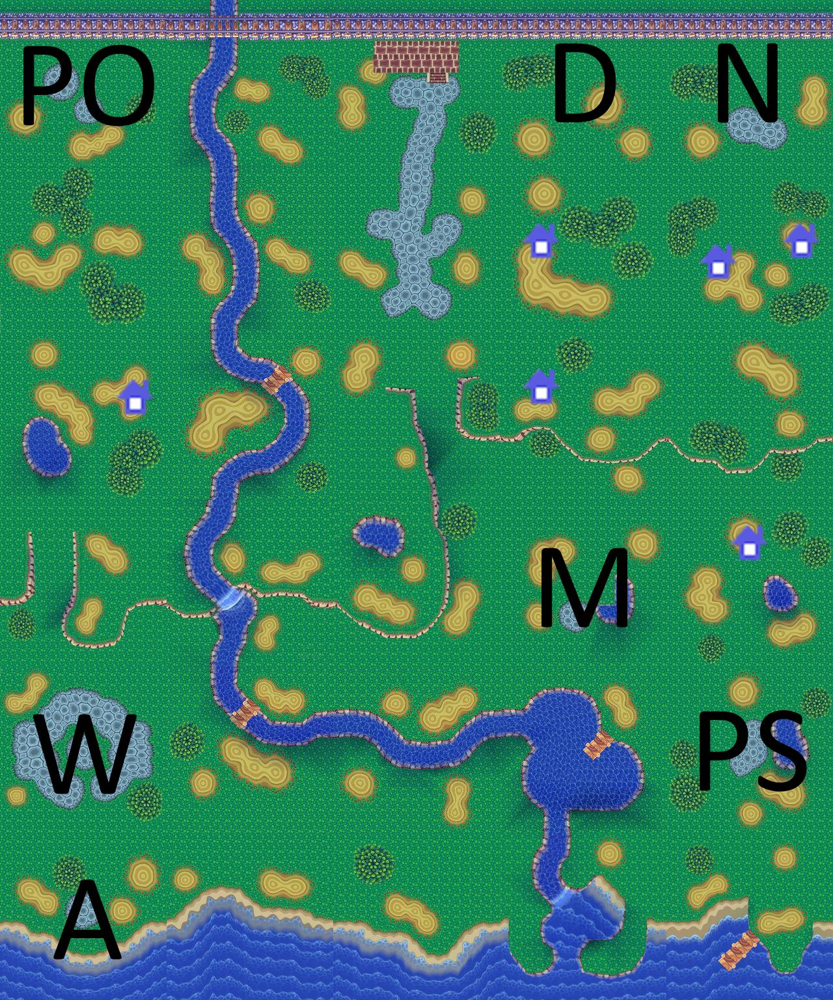

If you run into any bugs or want to request a feature, feel free to open an issue

# Usage
1. Have python 3.11+ and install/update the following modules: dolphin_memory_engine, Pillow, pathlib
2. Download the latest release or clone the repo
3. Run "run.bat" after the train sequence has started
4. The image "preview.jpg" will be saved in the root folder

# Credits
 - Thanks to all contributors of the Animal Crossing data megasheet
 - Thanks to Phil for their resources and answering any questions
 - Thanks to Cuyler and contributors of the ACSE project (https://github.com/Cuyler36/ACSE)

# Example Output
- D = Dump
- N = Nook
- PO = Post Office
- M = Museum
- PS = Police Station
- W = Wishing Well
- A = Able Sisters

