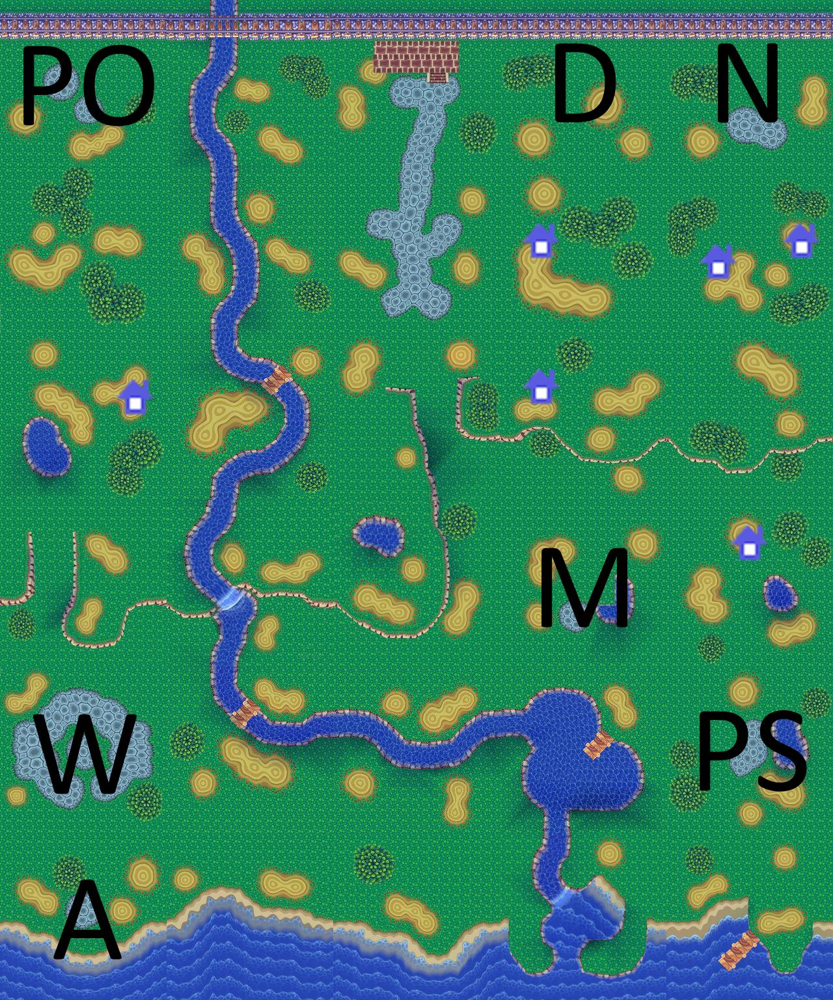

If you run into any bugs or want to request a feature, feel free to open an issue

# Usage
1a. Have python 3.11+ and install/update the following modules: dolphin_memory_engine, PIL, pathlib
1b. Download the latest release or clone the repo
2. Run "run.bat" after the train sequence has started at the beginning of the game
3. The image "preview.jpg" will be saved in the repo's root folder

# Credits
Thanks to all contributors of the Animal Crossing data megasheet
Thanks to Phil for their resources and answering any questions
Thanks to contributors of the ACSE project (https://github.com/Cuyler36/ACSE)

# Example Output
- D = Dump
- N = Nook
- PO = Post Office
- M = Museum
- PS = Police Station
- W = Wishing Well
- A = Able Sisters

