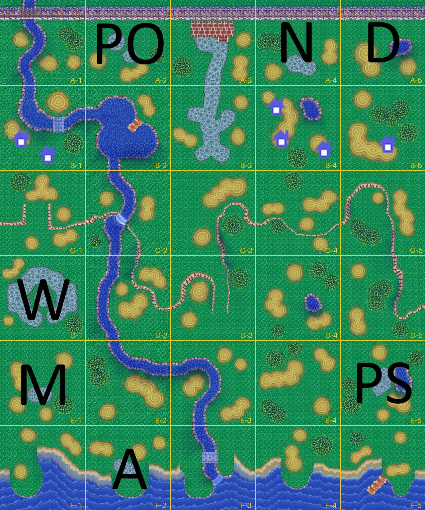

# Animal Crossing (2002) Map Previewer

Constructs a full overhead map of your Animal Crossing town.

## How it works

By utilizing [Dolphin Emulator](https://dolphin-emu.org/) along with the [Dolphin Memory Engine Library](https://github.com/randovania/py-dolphin-memory-engine), you can hook into the game's live memory to read and write values. 

With the help of the [acre documentation](https://docs.google.com/spreadsheets/d/13sRAcj9YbP9_i-u0Kg6S7ycHbaOQx1jFG4lYLm2DJ4c/edit?gid=1901208090#gid=1901208090), it becomes a matter of mapping the acre's ID to an image. With a little math, we can create a base image at the correct size and overlay each acre's image at the appropriate offset. If the acre contains a special building, a marker is overlayed as well.

Once we have the base town layout, it's time to search for the villagers' housing. While the villager IDs are static, their houses are placed more-or-less randomly in the game world, so we must find them. The game world is made up of a 5x6 grid of acres, with each acre being a 16x16 grid of tiles. We step through each tile until we find one that matches one of the villagers' ID, then overlay a marker.

Finally, with a little more math, we draw lines to visualize acre borders and label each acre appropriately (A-F, 1-5).

## Usage
1. Clone repo: `git clone https://github.com/JustinDMS/AC-Map-Preview.git`
2. Have Animal Crossing running on Dolphin
3. Run `run.bat`

## Credits
- [ACSE project](https://github.com/Cuyler36/ACSE)

## Example Output
- D = Dump
- N = Nook
- PO = Post Office
- M = Museum
- PS = Police Station
- W = Wishing Well
- A = Able Sisters

